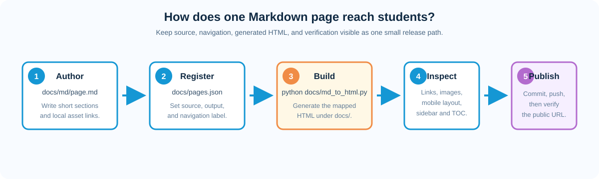

# Maintainer Authoring Guide

This illustrated guide is for course staff who maintain the public Markdown
site. Student-facing collaboration steps are in the
[Collaboration Workflow](collaboration_workflow.md). The completed API
reference and installation guide are generated/accepted areas: do not edit
their generated outputs as part of an ordinary Course Docs change.



## Repository map

| Purpose | Authoritative location | Generated or local result |
| --- | --- | --- |
| Public Markdown source | `docs/md/` | HTML under `docs/` |
| Site navigation and source/output mapping | `docs/pages.json` | Sidebar and page links |
| Shared site styles and responsive rules | `docs/docs-style.css` | Loaded by generated pages |
| Reusable course helpers | `ccai9012/` | Imported by notebooks |
| Weekly teaching material | `weekly_scripts/` | Notebook/script source |
| Final-project examples | `starter_kits/` | Notebook and module pages |
| API source/build | `docs/api_source/` | `docs/api/` (independent site) |

Generated HTML belongs with the Markdown-producing change. API HTML and
`docs/api_source/` are outside the remaining Course Docs scope unless an API
change is explicitly authorised.

## Worked example: add one course page

Use a temporary branch and a focused page name. Suppose the new source is
`docs/md/weekly_note.md`.

### 1. Write the source

Start with one `#` title, then use `##` sections and `###` subsections. Keep
explanatory Markdown beside the code or figure it explains. Use image paths
relative to the generated HTML location: a page generated at `docs/` can use
`figs/example.svg`; a page generated under `docs/starter_kits/` uses
`../figs/example.svg`.

### 2. Register it

Add one unique entry to the appropriate `pages` list in `docs/pages.json`:

```json
{
  "key": "weekly_note",
  "label": "Weekly Note",
  "title": "Weekly Note",
  "source": "weekly_note.md",
  "output": "weekly_note.html"
}
```

The `source` is relative to `docs/md/`; `output` is relative to `docs/`.
Do not add a second entry for the same Markdown source. Put a child entry
under an existing navigation node only when the page is genuinely part of
that section.

### 3. Build and inspect navigation

From the repository root, run:

```bash
conda run --no-capture-output -n ccai9012 python docs/md_to_html.py
```

Confirm the final conversion count, open `docs/weekly_note.html`, and check
that the sidebar highlights the new page. The right-hand **On this page**
panel is generated from `##` and `###` headings. A page that should be
linked but not shown in the sidebar can omit `pages.json` registration.

### 4. Diagnose a broken asset

If an image is missing, first inspect the generated HTML and copy its `src`
value. Resolve that URL from the HTML file's directory, not from the Markdown
source directory. Then check the case-sensitive source path:

```bash
test -f docs/figs/example.svg
rg -n "example.svg" docs/md/weekly_note.md docs/weekly_note.html
```

Use repository-local assets and descriptive alt text. Do not embed tokens in
URLs. If the asset is generated, put it under the owning example's ignored
output directory and document how to reproduce it instead of committing a
large derivative.

## Page and notebook review

Before handing off a page, check desktop and narrow-window rendering, long
headings, four-level lists, code blocks, tables, image scaling, the left
navigation, and the right table of contents. For notebook changes, open the
JSON with `nbformat`, parse every code cell, and run the smallest offline smoke
path that exercises the changed input/output mapping. Live paid API calls are
separate owner-approved checks.

Use package-level paths from `ccai9012.paths` for data, model, cache, and
repository resources. Notebook-local output should remain in the example's
`output/` directory. Keep `ccai9012/token.yaml`, private model/pricing notes,
personal absolute paths, checkpoints, and generated caches out of Git.

## Release hand-off

1. Review the path-scoped diff and run `git diff --check`.
2. Run the changed documentation conversion and relevant environment/test
   checks.
3. Scan changed Markdown, HTML, notebook source/output, and staged diffs for
   credentials and machine-specific paths.
4. In GitHub Desktop, pull before push and verify the rendered public page.

For private provider/model pricing, keep only a non-sensitive pointer in this
repository if the owner requests one; the private document itself is an
external deliverable and is not committed here.
